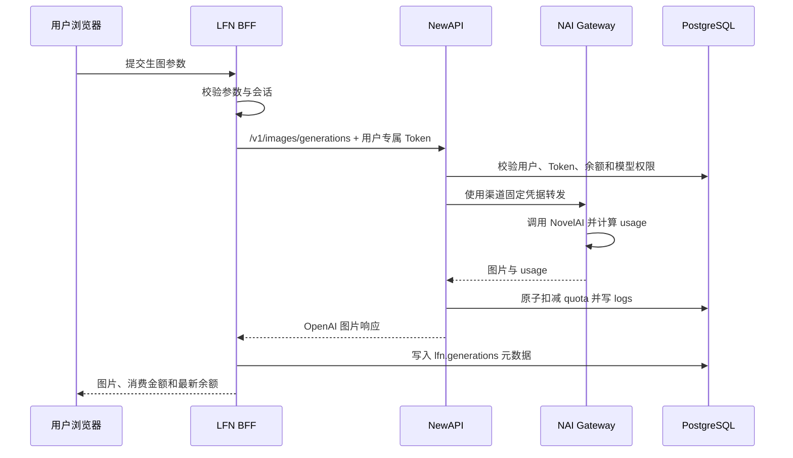
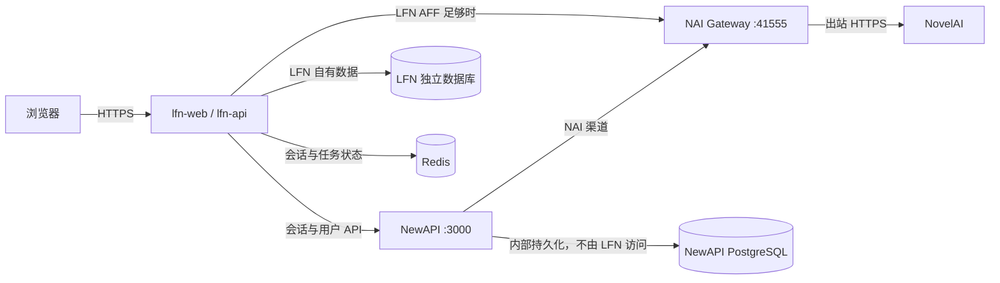

# Love for NAI 需求与架构草案

> 文档状态：需求澄清稿 v0.2  
> 项目名称：Love for NAI（简称 LFN）  
> 目标读者：产品、前端、后端、运维  
> 当前阶段：仅确认需求与技术路线，尚未开始开发

## 1. 项目目标

LFN 是面向现有 NewAPI 用户的中文 NovelAI 图像工作台。用户无需迁移账号、密码、API 密钥或余额，使用现有 NewAPI 账号直接登录；LFN 的余额、模型权限、密钥和消费记录与 NewAPI 实时互通。

LFN 的核心体验完整复刻 NovelAI Image 的工作流、信息结构和操作能力：左侧集中配置模型与生成参数，中间编辑提示词并查看生成结果，底部执行生成，右侧提供 LFN 的用户中心能力。视觉实现采用 LFN 自有品牌与中文界面，不复制 NovelAI 的源代码、商标、插图或其他专有素材。

项目不提供充值入口。NewAPI 是账号、钱包余额、NewAPI 模型权限、钱包计费和钱包消费日志的唯一事实来源；LFN 独立负责自己的 AFF、用户分组、角色、倍率和相应日志。

### 1.1 NewAPI 零修改硬约束

LFN 必须把现有 NewAPI 当作不可修改的外部服务：

- 不修改 NewAPI 源码、前端、镜像、容器、环境变量或配置；
- 不修改 NewAPI 数据库结构、数据、触发器、视图、函数或迁移；
- 不要求 NewAPI 新增路由、字段、计费资金源或日志格式；
- 不向 NewAPI 容器注入文件，不重启或替换 NewAPI；
- 只调用 NewAPI 当前已经公开的 HTTP API 和 OpenAI 兼容 API；
- 通过公开 API 注册用户、登录、更新资料、创建 Token、读取余额和发送模型请求属于正常使用，不视为修改 NewAPI；
- 所有 LFN 专属能力和数据只能在 `lfn-web`、`lfn-api`、LFN 独立数据库和 LFN 存储中实现。

## 2. 已核实的运行环境

2026-08-25 对远端服务器进行只读检查，当前运行态如下：

| 服务 | 运行方式 | 地址/网络 | 版本或镜像 |
|---|---|---|---|
| NewAPI | Docker 容器 `new-api` | 宿主机 `:3000`，容器网络 `new-api_default` | `calciumion/new-api:v1.0.0-rc.25` 对应构建 |
| PostgreSQL | Docker 容器 `postgres` | 容器内 `postgres:5432` | PostgreSQL 15 |
| Redis | Docker 容器 `redis` | 容器内 `redis:6379` | `redis:latest` |
| NAI Gateway | Docker 容器 `novelai-gateway` | 宿主机 `:41555` | 本仓库 Gateway |

NewAPI 数据库为 `new-api`，已存在 `users`、`tokens`、`logs`、`channels`、`options`、`user_sessions`、`two_fas` 等表。NewAPI 和 PostgreSQL 已在同一 Docker 网络中。

远端 NewAPI 当前配置已确认：

- 开启账号注册、用户名密码注册和用户名密码登录；
- 开启邮箱验证；
- 当前未开启 Turnstile；
- 当前未开启 Passkey 登录；
- `quota_per_unit = 500000`；
- NAI 渠道已指向服务器上的 NAI Gateway；
- NAI 模型的计费规则已配置在 NewAPI 中。

## 3. 产品范围

### 3.1 页面结构

桌面端主工作台采用四区布局：

1. **左侧生成设置栏**
   - 模型选择；
   - 图片尺寸、方向和自定义宽高；
   - 采样器、噪声调度、步数、CFG Scale；
   - Seed、生成张数；
   - 图生图、局部重绘、Vibe Transfer、精准参考；
   - 多角色提示词与角色位置；
   - 高级参数与重置参数。

2. **中间创作区**
   - 正向提示词和负向提示词；
   - 标签建议与自动补全；
   - 提示词标签编辑；
   - 图片上传、蒙版编辑和参考图管理；
   - 生成中、排队中、失败、余额不足等状态；
   - 当前结果预览和快捷操作。

3. **底部生成栏**
   - 本次预估消费；
   - 当前余额；
   - 生成按钮、张数和队列状态；
   - 自动保存开关。

4. **右侧用户与历史栏**
   - 生成历史；
   - NewAPI 同源使用日志；
   - 余额钱包；
   - 个人资料；
   - 可用模型和价格；
   - AFF 邀请信息。

移动端将以上区域改为底部导航和抽屉，不强行压缩为四栏。

### 3.2 路由建议

| 路由 | 页面 | 说明 |
|---|---|---|
| `/sign-in` | 登录 | 使用 NewAPI 现有账号体系 |
| `/sign-up` | 注册 | 遵循 NewAPI 的邮箱验证、AFF 和注册开关 |
| `/forgot-password` | 找回密码 | 复用 NewAPI 邮件与重置流程 |
| `/image` | 生图工作台 | 登录后的默认页 |
| `/history` | 生成历史 | LFN 图片记录与参数复用 |
| `/usage` | 使用日志 | 读取 NewAPI 用户日志 |
| `/wallet` | 余额钱包 | 显示同一份 NewAPI 美元余额，不提供充值 |
| `/profile` | 个人资料 | 读取和修改 NewAPI 资料 |
| `/models` | 模型列表 | 展示用户可用模型与计费说明 |
| `/keys` | API 密钥 | 分发、查看和管理与 NewAPI 互通的密钥 |
| `/aff` | 邀请中心 | LFN 自有邀请码、邀请关系、AFF 余额和流水 |
| `/admin/users` | LFN 用户管理 | 管理 LFN 角色、分组和个人倍率 |
| `/admin/groups` | LFN 分组管理 | 创建分组并设置默认消耗倍率 |
| `/admin/audit` | LFN 管理审计 | 查看角色、分组、倍率和 AFF 调整记录 |

所有用户可见文案必须为简体中文；上游原始错误需映射为可理解的中文错误，不直接把英文堆栈返回给用户。

### 3.3 图像能力矩阵

LFN 的“支持 NovelAI 官方所有功能”在一期内解释为：完整覆盖当前 NAI Gateway 已验证并可计费的能力。

| 能力 | Gateway 状态 | LFN 一期 |
|---|---|---|
| 文生图、多图生成 | 已支持 | 必须 |
| V3、V4、V4.5、V5 模型 | 已支持 | 必须，按用户模型权限过滤 |
| 正向/负向提示词 | 已支持 | 必须 |
| Seed、尺寸、步数、CFG、采样器、噪声调度 | 已支持 | 必须 |
| 多角色提示词与坐标 | 已支持 | 必须 |
| 图生图 | 已支持 | 必须 |
| 局部重绘与蒙版 | 已支持 | 必须 |
| Vibe Transfer | 已支持 | 必须 |
| Character Reference | 已支持 | 必须 |
| Precise Reference | 已支持 | 必须 |
| 标签建议 | 已支持专用端点 | 必须 |
| Danbooru 标签搜索、翻译和补全 | 需要 LFN 新增 | 必须 |
| Director：去杂物、去背景、线稿、草图、上色、表情 | 已支持 | 必须 |
| 放大 | Gateway 已支持专用端点 | 按 Gateway 计费文档开放 |
| 图片注释 | Gateway 已支持专用端点 | 按 Gateway 计费文档开放 |
| 透明背景等 V5 参数 | Gateway 支持情况需逐项验收 | 验收后开放 |
| 导入 NAI PNG 参数 | 需要新增元数据解析 | 必须 |

说明：绝大多数图片操作可通过 NewAPI 的标准 `POST /v1/images/generations`，使用 `novelai_operation` 分发至 Gateway，因此能够继续由 NewAPI 统一扣费和记录日志。Director Tools 使用 Gateway 文档中已验证的固定 Anlas 映射。LFN AFF 足额订单可由 LFN 服务端直连 Gateway 并写入 LFN 自有账本。`upscale` 和 `annotate` 在补齐可靠的动态 `usage` 映射前不得使用 LFN AFF，只能走可审计的 NewAPI 钱包计费路径。

## 4. 账号与会话

### 4.1 账号共用原则

- LFN 不创建第二套用户表；
- LFN 不复制或迁移密码哈希；
- LFN 不自行验证 NewAPI 密码；
- 登录、注册、邮箱验证、两步验证、找回密码、资料修改均调用 NewAPI 业务接口；
- NewAPI 新增用户后可立即登录 LFN，LFN 新注册用户也可立即登录 NewAPI；
- 用户禁用、分组变更、模型权限变更应实时对 LFN 生效。

### 4.2 推荐会话方案：LFN BFF

浏览器只连接 LFN Backend for Frontend（BFF）。BFF 代理 NewAPI 登录/注册请求，并在 Redis 中保存对应的 NewAPI 会话；浏览器只持有 `HttpOnly + Secure + SameSite` 的 LFN 会话 Cookie。

这样可以避免：

- 浏览器直接接触 NewAPI API Token；
- 跨端口 Cookie、CORS 和 SameSite 问题；
- LFN 复制 NewAPI 的密码校验与 2FA 逻辑；
- 在前端暴露 NAI Gateway 的固定鉴权信息。

NewAPI 的用户 API 需要同时携带会话和 `New-Api-User` 请求头，LFN BFF 必须按已登录用户 ID 正确转发，不得信任浏览器自行提交的用户 ID。

### 4.3 完整登录注册流程

登录流程：

1. 用户在 `/sign-in` 输入 NewAPI 用户名和密码；
2. LFN BFF 调用 NewAPI `/api/user/login`；
3. 若要求 2FA，进入中文二次验证页；
4. 登录成功后，BFF 保存上游会话并创建 LFN 会话；
5. BFF 调用 `/api/user/self` 获取 NewAPI 用户、钱包余额和模型分组，再从 LFN 数据库读取 LFN 角色、计费分组、倍率和 AFF 信息；
6. 进入 `/image`。

注册流程必须读取 NewAPI `/api/status` 的动态开关。当前邮箱验证已开启，因此至少包含：用户名、邮箱、密码、确认密码、邮箱验证码、可选 AFF 邀请码。LFN 不允许绕过 NewAPI 的注册限制、风控或验证码。

### 4.4 API 密钥互通与分发

LFN 不创建第二套 API 密钥系统，直接复用 NewAPI `tokens`：

- 用户在 NewAPI 已创建的 `sk-*` 密钥可直接用于 LFN API；
- 用户在 LFN `/keys` 创建的密钥实际通过 NewAPI Token API 创建，因此也可直接用于 NewAPI；
- 密钥状态、模型限制、额度限制、有效期和 IP 白名单均沿用 NewAPI；
- LFN 只在用户明确请求查看完整密钥时，经二次验证后调用 NewAPI 取回；
- 网页生图可使用用户选定的现有密钥，也可由 LFN 创建专用密钥；
- LFN 自身不保存密钥明文，只保存 NewAPI Token ID 和用途标记。

这意味着“密钥分发”是 NewAPI Token 管理能力的中文 LFN 界面，不是另发一套与 NewAPI 无关的 Key。

### 4.5 LFN 管理员与权限

LFN 建立自己的角色和权限表，不修改或复用 NewAPI 的角色字段作为可写权限来源。首次部署时按 NewAPI 不可变用户 ID 初始化两名 LFN 超级管理员：

| NewAPI 用户 ID | 已核实用户名 | LFN 初始角色 |
|---:|---|---|
| `1` | `ikun` | 超级管理员 |
| `3` | `Lycoris` | 超级管理员 |

管理员身份必须按 NewAPI 用户 ID 判断，不能按用户名或显示名判断。用户改名后权限不变；账号被 NewAPI 禁用后，LFN 管理权限和登录会立即失效。

LFN 角色建议分为：

- **超级管理员**：管理管理员、用户分组、倍率、LFN AFF、系统策略和审计日志；
- **管理员**：管理普通用户的 LFN 分组与个人倍率，查看必要的 LFN 业务日志；
- **普通用户**：使用生图、历史、钱包、密钥、模型和邀请功能。

只有超级管理员可以授予或撤销管理员角色。默认超级管理员不能在普通后台操作中删除自己的最后一个有效超级管理员身份，避免系统失去管理入口。所有授权、撤权、分组和倍率变更必须写入 LFN 审计日志。

## 5. 余额与计费

### 5.1 单一余额来源

NewAPI `users.quota` 是钱包余额的唯一事实来源。LFN 不建立可独立增减的余额字段，也不执行一次性“余额迁移”。LFN 读取 NewAPI 当前站点配置中的 `quota_per_unit`，使用与 NewAPI 相同的美元换算：

```text
LFN 余额 = users.quota / quota_per_unit
当前 quota_per_unit = 500,000
```

LFN 只去掉美元符号，不改变数值。例如 NewAPI 显示 `$5,666.04`，LFN 显示 `5666.04`。消费日志同样按照 `logs.quota / quota_per_unit` 显示余额消耗。

界面统一称为“余额”，不称为积分，也不展示原始 quota 数值。换算仅影响显示，不改变底层余额和 NewAPI 计费。

### 5.2 生图扣费路径

网页生图请求最终必须关联一枚真实 NewAPI Token。可以是用户选定的现有密钥，也可以是 LFN 为用户创建的专用密钥。专用 Token：

- 归属真实 NewAPI 用户；
- 名称固定带 `lfn` 标识，便于日志筛选；
- 仅允许 NAI 图像模型；
- 不返回给浏览器；
- 由 LFN BFF 经 NewAPI Token API 创建和读取；
- 可配置来源 IP 限制；
- 用户退出登录时不必删除，用户禁用或 Token 禁用后立即失效。

生图链路：



浏览器永远不能直连 Gateway `:41555`。LFN BFF 只有在已登录网页用户的 LFN AFF 足额、模型属于允许的 `nai-*` 清单且已成功冻结额度时才能直连；其他网页请求和全部外部 API 请求必须经过 NewAPI。

### 5.3 AFF 优先消费

LFN 建立完全独立的 AFF 邀请与奖励账本，不读取、复制或修改 NewAPI 的 `aff_quota`。两套 AFF 在数据和用途上互不相干：

- NewAPI AFF 仍由 NewAPI 自己管理，LFN 不调用其转入钱包接口；
- LFN AFF 由 LFN 独立数据库管理，只能在 LFN 网页生图中消费；
- LFN AFF 不能提现、不能转入 NewAPI 钱包、不能在用户间转账；
- LFN AFF 余额与 NewAPI 钱包余额分栏显示，不能相加伪装成同一种余额；
- LFN 邀请码、邀请关系、奖励规则、冻结与解冻均由 LFN 自己维护。

#### 整单资金源规则

在不修改 NewAPI 的前提下，一次模型请求不能按金额拆成“部分 LFN AFF、部分 NewAPI 钱包”。因此 AFF 优先采用整单资金源选择：

1. LFN 根据模型和参数计算本次最大可计费用量；
2. LFN AFF 足以覆盖整次请求时，原子冻结对应 AFF；
3. 该请求由 LFN 服务端使用固定 Gateway 凭据直连 NAI Gateway，不经过 NewAPI；
4. Gateway 成功响应后，根据真实 `usage` 结算 LFN AFF，多冻结部分退回；
5. Gateway 失败时完整解冻，不扣 LFN AFF；
6. LFN AFF 不足以覆盖整次请求时，不消耗残余 AFF，整次请求使用用户 NewAPI Key 经过 NewAPI，由 NewAPI 钱包按原规则扣费；
7. 界面在提交前明确显示“本次使用 LFN 邀请余额”或“邀请余额不足，本次使用 NewAPI 钱包”。

这种方案实现的是“AFF 整单优先”，不是单次请求的部分抵扣。残余 AFF 可留待足以覆盖的较低费用请求使用。

#### LFN AFF 账本

LFN 必须使用不可变流水账，而不是只在用户表保存一个可随意修改的数字：

- 每次奖励、冻结、结算、退款、过期和管理员修正都生成唯一流水；
- 可用余额由已入账额度减去冻结与已消费额度得到；
- 邀请奖励需使用幂等事件键，防止重复发放；
- 生成记录关联 AFF 流水 ID、Gateway 请求 ID、模型和真实 `usage`；
- 后台只能通过追加修正流水调整余额，不能直接覆盖余额字段；
- AFF 计价必须复用 Gateway 当前计费公式和动态 `usage` 映射。

LFN AFF 仅对已登录的网页工作台启用。对外 `/v1/*` 和 `/ai/*` API 使用调用方提交的 NewAPI Key 并经 NewAPI 计费，避免无法从 API Key 安全定位 LFN AFF 账户。没有可靠动态 `usage` 或无法在执行前计算最大费用的操作不允许使用 LFN AFF。

### 5.4 日志与钱包

- 使用日志读取 NewAPI `/api/log/self`；
- 汇总读取 `/api/log/self/stat`；
- 钱包余额读取 `/api/user/self` 的 `quota`；
- 合并展示 NewAPI 钱包日志与 LFN AFF 消费日志，并清楚标注资金来源；
- LFN 生成历史关联 NewAPI `request_id`，便于对账；
- 不展示充值、支付、兑换码入口；
- AFF 页面展示 LFN 邀请码、邀请人数、可用余额、冻结余额和奖励流水；
- 可另行只读展示 NewAPI AFF 信息，但不能与 LFN AFF 合并，也不提供转入钱包操作。

### 5.5 LFN 用户分组与消耗倍率

LFN 支持独立用户分组。管理员可为每个分组设置默认消耗倍率，也可为单个用户设置个人覆盖倍率：

```text
有效倍率 = 个人覆盖倍率（若设置）否则分组默认倍率
LFN 实扣 = Gateway 基础费用 × 有效倍率
```

建议约束：

- 倍率使用定点小数或数据库 `numeric`，禁止二进制浮点累计余额；
- 默认分组为 `default`，默认倍率 `1.0`；
- 倍率允许范围建议为 `0.0` 至 `10.0`，最多 4 位小数；
- `0.0` 表示 LFN 自管链中的免费用户，必须由超级管理员设置；
- 分组变更和个人倍率覆盖只影响变更后的新请求，不追溯历史订单；
- 每次生成记录必须保存当时的分组、基础费用、有效倍率和最终费用快照；
- 管理员修改倍率时必须填写原因并写审计日志；
- 批量修改需要二次确认并显示受影响用户数量。

#### 倍率适用边界

LFN 不能修改 NewAPI 的定价或实际钱包扣款，因此倍率按资金链区分：

| 资金链 | LFN 倍率是否生效 | 实际行为 |
|---|---|---|
| LFN AFF 网页订单 | 是 | 按 `Gateway 基础费用 × LFN 有效倍率` 从 LFN AFF 结算 |
| NewAPI 钱包网页订单 | 否 | NewAPI 按自身既有模型、分组和 Token 规则扣款 |
| 对外 `/v1/*`、`/ai/*` API | 否 | 使用调用方 NewAPI Key，由 NewAPI 原规则扣款 |

管理界面必须分别展示“LFN 倍率”和“NewAPI 实际计费”。不能把 LFN 倍率显示为会改变 NewAPI 钱包消费，也不能在钱包订单后通过修改 NewAPI 数据或隐式返现来模拟倍率。

资金源选择时，LFN AFF 足额判断必须使用乘以有效倍率后的最大费用。若 AFF 不足，整单回退 NewAPI 钱包，LFN 倍率不参与该订单。

## 6. 数据库设计

### 6.1 共库边界

NewAPI 是不可修改的外部依赖。LFN 不连接 NewAPI PostgreSQL，不读取或写入 NewAPI 数据表，也不在 `new-api` 数据库创建 schema、表、触发器、视图或函数。账号、余额、密钥、模型和日志一律通过 NewAPI 现有公开 API 获取或操作。

LFN 使用自己独立的数据库和数据库账号，由 `lfn-api` 独占管理：

| 表 | 用途 | 与 NewAPI 用户关联 |
|---|---|---|
| `lfn.user_preferences` | 工作台偏好、默认参数 | `newapi_user_id` |
| `lfn.generation_presets` | 用户预设 | `newapi_user_id` |
| `lfn.generations` | 图片历史、参数、状态、消耗、请求 ID | `newapi_user_id` |
| `lfn.generation_assets` | 原图、蒙版、参考图、结果图元数据 | `generation_id` |
| `lfn.internal_tokens` | NewAPI Token ID 的用途引用，不保存 Key | `newapi_user_id` |
| `lfn.aff_accounts` | LFN AFF 账户状态与汇总缓存 | `newapi_user_id` |
| `lfn.aff_referrals` | LFN 邀请码、邀请关系与达标状态 | `inviter_user_id`、`invitee_user_id` |
| `lfn.aff_ledger` | 奖励、冻结、结算、退款、过期和修正流水 | `newapi_user_id` |
| `lfn.aff_holds` | 生图请求的 AFF 预冻结及最终结算状态 | `generation_id` |
| `lfn.user_roles` | LFN 角色分配 | `newapi_user_id` |
| `lfn.user_groups` | LFN 用户所属分组与个人倍率覆盖 | `newapi_user_id` |
| `lfn.groups` | 分组名称、默认倍率和状态 | `id` |
| `lfn.admin_audit` | 角色、分组、倍率和 AFF 管理审计 | `actor_user_id`、`target_user_id` |

LFN 数据表只保存自己的产品数据。`newapi_user_id` 是外部身份引用，不建立跨数据库外键。严禁直接读取或修改 NewAPI 的 `users`、`tokens`、`logs`、`options` 等表。

`lfn.internal_tokens` 不保存 Key 明文，只保存 NewAPI Token ID、用户 ID和用途。

AFF 账本表必须使用数据库事务、唯一幂等键和行锁。`aff_accounts` 中的汇总余额仅用于快速读取，可从 `aff_ledger` 重建；任何余额变化都必须先写流水。

首次迁移必须幂等创建 `default` 分组，并按 NewAPI 用户 ID `1`、`3` 写入超级管理员角色。重复部署不得生成重复角色记录，也不得覆盖管理员后来设置的分组或倍率。用户名只作为审计快照展示，不作为授权主键。

### 6.2 图片存储与保留规则

PostgreSQL 只保存图片元数据和对象键，不直接存大体积 Base64。图片文件使用服务器本地持久卷或 S3 兼容对象存储，并满足：

- 对象路径按用户隔离；
- 下载必须校验资源所有者；
- 未手动保存的图片只保留最近 10 张，生成第 11 张时自动清理最旧的一张；
- 用户手动保存的服务器图片最多 30 张，达到上限后必须由用户删除或取消保存，不能静默覆盖；
- 手动保存必须持久化原图、生成参数和必要元数据；
- 用户可导出 ZIP 到本地，ZIP 只归档图片原始格式文件和参数清单，不改变图片编码；
- ZIP 导出完成不等于服务器保存，用户可选择导出后从服务器删除；
- 删除历史时同步删除对象；
- 日志不记录图片 Base64、密码、Cookie、API Token 或固定网关凭据。

### 6.3 图片参数导入

LFN 支持导入 NovelAI 生成的 PNG，并解析 PNG `tEXt`、`zTXt`、`iTXt` 中的 `Comment`、`Description`、`Software`、`Source` 等元数据。当前 Gateway 只保证返回图片时保留这些元数据，尚无导入解析 API，因此需要新增 `POST /api/lfn/images/inspect`。

导入流程必须人性化且不可静默覆盖：

1. 用户上传图片后先进行本地或服务端只读解析；
2. 显示可导入内容摘要和字段差异；
3. 用户选择“全部替换”“仅提示词”“仅生成参数”“作为图生图图片”或“仅导入图片”；
4. 对模型、提示词、负面提示词、尺寸、采样器、噪声调度、步数、CFG、Seed、角色提示词和参考参数逐项预览；
5. 只有用户确认后才覆盖当前工作台；
6. 不认识、越界或当前模型不支持的字段标为“无法导入”，不得偷偷使用默认值；
7. 非 NAI 图片仍可选择作为图生图、重绘、Vibe 或参考图使用。

## 7. 服务架构

建议拆为两个 LFN 容器：

| 服务 | 职责 |
|---|---|
| `lfn-web` | 中文 Web UI、工作台、历史、钱包、资料和模型页 |
| `lfn-api` | BFF、NewAPI 会话代理、生图代理、参数校验、历史与对象存储 |

LFN 可复用 Redis 服务但必须使用独立数据库编号或键前缀；LFN 使用独立数据库，不新增第二套身份服务或计费服务。



网页生图存在两条互斥调用链：

- **LFN AFF 链**：浏览器 → LFN → Gateway；费用只写 LFN AFF 流水和 LFN 生成日志；
- **NewAPI 钱包链**：浏览器 → LFN → NewAPI → Gateway；费用和日志由 NewAPI 处理，LFN 只保存关联请求 ID。

同一次生成只能选择一条链，禁止同时调用两条链，也禁止失败后自动切换到另一条链重试，以免重复生成或双重扣费。

生产环境只对外暴露统一 HTTPS 域名。PostgreSQL、Redis、NewAPI 容器端口和 Gateway 端口应尽量仅在 Docker 网络或防火墙白名单内可达。

## 8. 安全要求

1. 用户提供的 NewAPI 渠道 Key 和 Gateway 鉴权值视为已暴露凭据，开发前应轮换；本文档不记录其明文。
2. Gateway 固定鉴权只能保存在 NewAPI 渠道或服务端 Secret 中，不能写入前端代码、接口响应、日志或 Git。
3. LFN 不在自有表保存 NewAPI Key 明文；网页 BFF 只引用 NewAPI Token ID，对外 API 则校验调用方主动提交的 Bearer Key。
4. 所有生图参数必须做大小、数量、枚举、Base64 体积和 MIME 校验。
5. 对登录、注册、验证码、标签建议和生图接口设置用户级与 IP 级限流。
6. 图片访问执行对象级授权，不能仅依赖不可猜 URL。
7. Cookie 使用 `HttpOnly`、`Secure`、合适的 `SameSite`，状态修改接口启用 CSRF 防护。
8. 错误响应不得泄露上游账号、渠道配置、数据库地址和内部堆栈。
9. LFN 数据库账号遵循最小权限，且不拥有连接 NewAPI 数据库的凭据。
10. 上线前完成数据库备份和恢复演练，避免 NewAPI 自动升级与 LFN 迁移同时执行。

## 9. 接口边界建议

### 9.1 网页 BFF 接口

LFN 前端只调用自己的 `/api/lfn/*`：

| LFN API | 下游来源 |
|---|---|
| `POST /api/lfn/auth/sign-in` | NewAPI `/api/user/login` |
| `POST /api/lfn/auth/sign-up` | NewAPI `/api/user/register` |
| `POST /api/lfn/auth/sign-out` | NewAPI `/api/user/logout` + 清理 LFN 会话 |
| `GET /api/lfn/me` | NewAPI `/api/user/self` |
| `PUT /api/lfn/me` | NewAPI `/api/user/self` |
| `GET /api/lfn/models` | NewAPI `/api/user/models` 和价格配置 |
| `GET /api/lfn/wallet` | NewAPI 美元余额与 LFN AFF 余额，分栏返回 |
| `GET /api/lfn/usage` | NewAPI `/api/log/self` |
| `POST /api/lfn/images/generate` | NewAPI `/v1/images/generations` |
| `POST /api/lfn/images/suggest-tags` | 需经可审计的 NewAPI 路径或单独零费用策略 |
| `POST /api/lfn/images/inspect` | 解析导入图片参数，不执行生成 |
| `GET/POST/PUT/DELETE /api/lfn/keys` | 代理 NewAPI Token API |
| `GET /api/lfn/history` | `lfn.generations` |
| `GET /api/lfn/aff` | LFN AFF 账户、邀请关系和流水 |
| `GET /api/lfn/admin/users` | 查询 LFN 用户角色、分组和倍率 |
| `PUT /api/lfn/admin/users/{user_id}/role` | 超级管理员修改 LFN 角色 |
| `PUT /api/lfn/admin/users/{user_id}/billing` | 管理员修改分组或个人倍率 |
| `GET/POST/PUT /api/lfn/admin/groups` | 管理 LFN 分组和默认倍率 |
| `GET /api/lfn/admin/audit` | 查询 LFN 管理审计日志 |

LFN API 负责把上游字段转换为稳定的中文产品模型。前端不应依赖 NewAPI 内部响应结构，以降低 NewAPI 更新带来的破坏。

所有 `/api/lfn/admin/*` 接口只操作 LFN 独立数据库。它们不得调用 NewAPI 管理员接口修改 NewAPI 用户、角色、分组、额度或模型权限。目标用户 ID 必须先通过当前登录会话或 NewAPI 公开用户信息验证存在性，且所有写操作要求 CSRF、防重放和审计原因。

### 9.2 对外兼容 API

LFN 同时提供两组外部 API，均接受 NewAPI 已有 `sk-*` 密钥和 LFN 分发的同源密钥：

**OpenAI 兼容路径**

- `GET /v1/models`：仅返回当前用户可用的 `nai-*` 模型；
- 兼容别名 `GET /v1/model`，但文档和 SDK 统一推荐标准复数路径 `/v1/models`；
- `POST /v1/images/generations`：文生图和 `novelai_operation` 统一入口；
- `POST /v1/images/edits`：OpenAI 图片编辑兼容；
- 其他 Gateway 已支持的 `/v1/images/*` 能力按计费映射开放。

**NovelAI 官方风格路径**

- `POST /ai/generate-image`；
- `POST /ai/encode-vibe`；
- `GET /ai/generate-image/suggest-tags`；
- `POST /ai/upscale`；
- `POST /ai/augment-image` 及已支持的 Director 能力；
- 后续按 Gateway 能力矩阵补齐官方图片路径。

官方风格入口不能简单透明转发 Gateway 的 `/_api/*`，否则会绕过 NewAPI 用户计费。LFN API 必须完成官方 payload 到内部统一计费请求的转换，并把响应还原为官方兼容格式。对外 `/ai/*` 请求使用真实 NewAPI Token 完成鉴权、模型限制、钱包扣费和日志记录，不使用 LFN AFF；仅已登录网页工作台可按整单资金源规则使用 LFN AFF。

`GET /v1/models` 只暴露 `nai-*`。用户为 Danbooru 智能助手选择的其他 NewAPI 模型只出现在 LFN 设置页，不出现在 LFN 对外模型列表。

### 9.3 Danbooru 与智能标签助手

LFN 提供两层标签能力：

1. **Danbooru 标签层**：查询标签、别名、分类、热度和联想，支持中英文搜索并输出规范英文 tag；
2. **NewAPI 模型助手层**：用户可从自己有权限的非 NAI 模型中选择一个，用于翻译自然语言、整理标签、生成负面提示词和提出参数调整建议。

智能助手不得直接改动当前创作内容。每次结果以差异预览展示，用户可选择：

- 追加标签；
- 替换提示词；
- 只替换负面提示词；
- 应用推荐参数；
- 应用全部建议；
- 放弃建议。

“应用全部建议”也必须二次确认，并列出会变化的模型、尺寸、采样器、步数、CFG、Seed、提示词和角色参数。调用 NewAPI 模型助手产生的费用按该模型原有规则从同一用户余额扣除，并写入 NewAPI 日志；Danbooru 公共查询本身不按模型收费，但需要缓存、限流并遵守数据源使用条款。

## 10. 非功能要求

- 桌面端目标宽度从 1280px 起，移动端从 360px 起；
- 生图请求支持取消等待，但已经到达上游的请求不能承诺撤销计费；
- BFF 不对同一请求自动重试生图，避免重复扣费；
- 使用幂等键防止用户双击导致重复提交；
- 图片结果到达后立即记录请求 ID、用户 ID、模型、参数摘要和消费额度；
- NewAPI 或 Gateway 不可用时明确区分登录失败、余额不足、排队、限额和上游故障；
- 关键链路记录结构化审计日志，但不记录敏感字段；未手动保存时仅为最近 10 张保留完整提示词和参数，手动保存时最多保留 30 张；
- LFN 与当前 NewAPI 版本做集成测试，NewAPI 自动更新后执行兼容性冒烟测试。

## 11. 分阶段实施建议

### 阶段 A：技术验证

- 搭建 LFN BFF 与 NewAPI 会话代理；
- 验证现有用户登录、邮箱注册、2FA 分支；
- 验证用户现有 NewAPI Token，并按需通过 NewAPI Token API 创建专用 Token；LFN 只保存 Token ID 和用途引用；
- 用测试用户完成一次生图，确认 `users.quota`、`tokens.used_quota`、`logs` 同步变化；
- 初始化 LFN 默认分组及用户 ID `1`、`3` 的超级管理员角色；
- 验证美元余额显示、AFF 整单资金源选择、倍率快照和请求 ID 对账。

### 阶段 B：最小可用产品

- 中文登录注册；
- 文生图工作台；
- 模型、提示词、尺寸、采样、步数、CFG、Seed、多图；
- 图片历史、下载、复用参数；
- 钱包、日志、个人资料、模型页、密钥和 AFF；
- LFN 用户、角色、分组、个人倍率和管理审计页面；
- 不含充值。

### 阶段 C：完整 NAI 工具

- 图生图、蒙版重绘；
- Vibe、Character Reference、Precise Reference；
- 多角色提示词编辑器；
- 标签建议与全部 Director Tools；
- Danbooru 与可选 NewAPI 模型智能助手；
- 图片参数导入和差异确认；
- 按 Gateway 计费文档完成放大与注释。

### 阶段 D：上线与加固

- HTTPS、限流、CSRF、对象授权、Secret 轮换；
- 数据库备份和恢复演练；
- 并发扣费、重复提交和故障恢复测试；
- 桌面与移动端视觉验收；
- NewAPI/Gateway 升级兼容性检查。

## 12. 验收标准

1. 同一账号可分别登录 NewAPI 和 LFN，密码、禁用状态和 NewAPI 模型分组保持一致；LFN 角色与计费分组独立存储。
2. 在任一侧注册的用户无需迁移即可登录另一侧。
3. LFN 不保存第二份密码，不向浏览器发送 NewAPI Token 或 Gateway 凭据。
4. NewAPI 钱包订单按既有模型规则准确扣减一次；LFN AFF 订单不扣 NewAPI 钱包，只按费用快照和 LFN 有效倍率结算一次。
5. NewAPI 钱包订单可与 NewAPI 日志按请求 ID 对账；LFN AFF 订单与 Gateway 请求 ID、LFN AFF 流水对账，并在 LFN 日志页合并展示。
6. NewAPI 显示 `$5,666.04` 时，LFN 显示余额 `5666.04`；LFN 不运行余额同步定时任务。
7. 用户只能访问自己的图片、预设、历史和日志。
8. 用户只能选择其 NewAPI 分组允许的模型。
9. 所有一期用户界面和用户可见错误均为简体中文。
10. 文档功能矩阵中标记“必须”的能力均有接口测试和端到端测试。
11. 余额不足、模型无权限、Gateway 429、上游 5xx 和网络超时均有明确状态，且不会静默重试扣费请求。
12. NewAPI 继续独立可用；LFN AFF 完全位于 LFN，且不改变 NewAPI 的账号、钱包余额、日志和普通请求计费语义。
13. NewAPI 的现有密钥可直接访问 LFN `/v1/*` 与官方风格 `/ai/*`；LFN 创建的密钥也可在 NewAPI 使用。
14. LFN AFF 足够时整单使用 AFF 并直连 Gateway；不足时不消耗 AFF，整单经 NewAPI 钱包计费；任何请求只执行一次。
15. 未保存历史始终最多 10 张，手动保存始终最多 30 张，ZIP 导出保留原始图片格式。
16. 导入带 NAI 元数据的图片时，任何参数覆盖都必须先展示差异并获得用户确认。
17. `/v1/models` 和 `/v1/model` 只返回当前用户可用的 `nai-*` 模型。
18. NewAPI 用户 ID `1`（`ikun`）和 ID `3`（`Lycoris`）首次部署后均为 LFN 超级管理员，重复初始化不产生重复数据或覆盖后续配置。
19. 管理员可设置用户的 LFN 分组和个人倍率覆盖；新 AFF 订单按请求时倍率快照结算，历史订单不受后续修改影响。
20. LFN 倍率不改变 NewAPI 钱包或外部 API 的实际扣款，界面和日志能明确区分 LFN 倍率、资金源及 NewAPI 实际计费。
21. 所有角色、分组、倍率和 AFF 管理写操作均记录操作者、目标、变更前后值、原因和时间，普通用户不能访问管理 API。

## 13. 待确认项

已确认：

1. 余额直接沿用 NewAPI 美元显示数值，去掉 `$` 符号，不使用积分概念；
2. 正式域名为 `lycoris-radiata.fans`；
3. 保留 NewAPI 当前完整注册流程；
4. LFN 与 NewAPI 双向复用同一套 API 密钥，并支持 LFN 分发密钥；
5. 未保存最近 10 张，手动保存最多 30 张，支持原格式 ZIP 导出；
6. 提示词和参数按上述历史保留策略保存；
7. LFN 自建独立 AFF 账本，按整单优先消费，不可提现、转账或转入 NewAPI 钱包；
8. 对外模型列表只显示 `nai-*`，智能标签助手可选用户有权限的其他 NewAPI 模型；
9. 放大和注释依据 Gateway 当前动态计费文档实现；旧条件倍率表中的 `upscale ×4`、`annotate ×1` 只能作为定价参考，必须先转换成可审计的 `usage` 规则；
10. 完整复刻 NovelAI Image 的工作流和布局，并使用 LFN 自有中文品牌资源；
11. 支持导入图片、解析参数、预览差异并由用户选择替换范围；
12. LFN 建立独立用户分组和个人倍率覆盖，默认超级管理员为 NewAPI 用户 ID `1` 和 `3`；倍率只作用于 LFN 自管资金链；
13. `lycoris-radiata.fans` 主域名直接承载 LFN，不另设 `nai` 子域名；
14. ZIP 导出同时附带机器可读的 JSON 参数清单和方便用户查看的文本参数清单；
15. Danbooru 标签、别名、分类、热度和联想直接查询 Danbooru 官方 API，并在 LFN 服务端做缓存与限流；
16. 图片导入只恢复 PNG 元数据中实际存在的提示词和生成参数；PNG 不包含原参考图文件时，不提供或伪造参考图恢复。

待确认状态：

当前产品范围内无待确认项；实现过程中若发现 Gateway、NewAPI 或 NovelAI 上游存在未记录的技术限制，再单独补充决策记录。

## 14. 当前结论

需求在 NewAPI 零修改约束下技术上可行。最终实现边界是：

- 账号、认证、用户资料、模型权限、钱包余额、密钥、计费、日志由 NewAPI 负责；
- NAI 实际请求由 NewAPI 渠道转发到现有 NAI Gateway；
- LFN 负责中文创作体验、参数编辑、图片历史和用户界面；
- LFN 自有数据放在独立数据库，不连接 NewAPI PostgreSQL；
- 所有敏感 Token 与固定 Gateway 凭据只存在于服务端；
- LFN 余额是 NewAPI 美元余额的实时数值，不复制余额、不做双向同步任务；
- LFN AFF 是独立奖励账本，足额时承担整次网页生成，不与 NewAPI `aff_quota` 混用；
- LFN 角色、用户分组和个人倍率独立存储；用户 ID `1`、`3` 幂等初始化为超级管理员，倍率只影响 LFN AFF 等自管资金；
- LFN 同时提供 OpenAI `/v1/*` 与 NovelAI 官方风格 `/ai/*`，外部 API 统一经过 NewAPI 计费；只有已登录网页工作台的足额 LFN AFF 订单使用 LFN 自有计费链。

账号、密钥、钱包余额和 NewAPI 请求日志通过 NewAPI API 实时互通，而不是数据库共写。LFN AFF 请求使用 Gateway 计费公式并记录在 LFN 自有日志中，再由 LFN 日志页合并展示两种来源。该边界确保 LFN 不改变 NewAPI 的任何代码、数据结构、配置或运行行为。